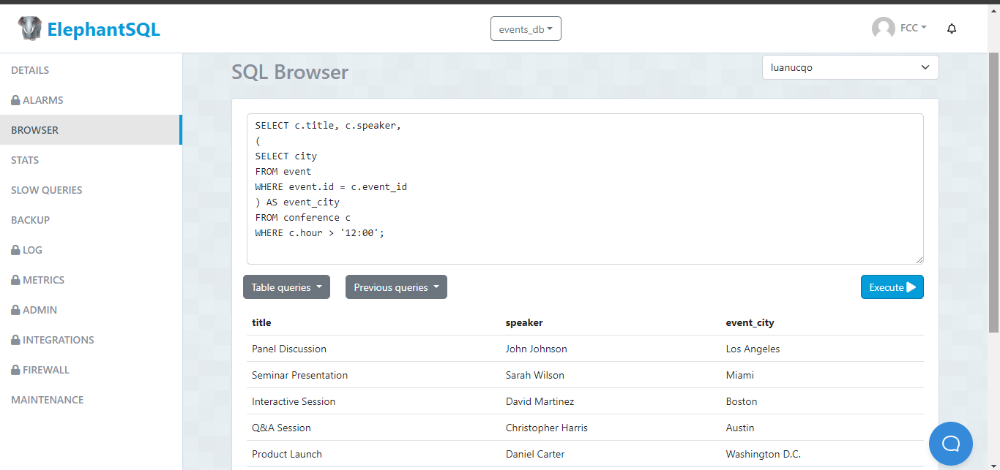
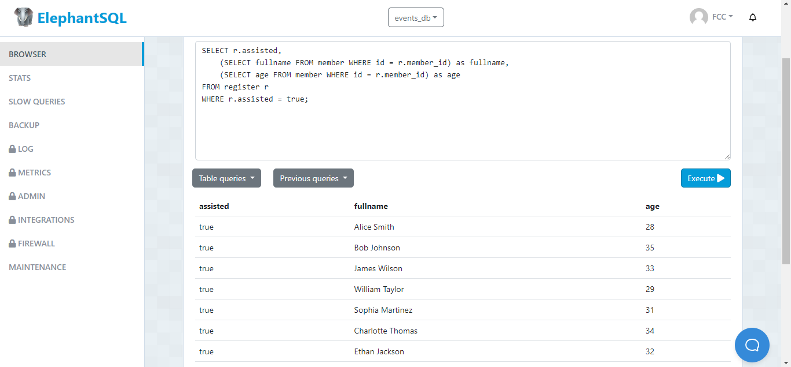

# TCS13---Subconsultas-event

## 1. Subconsulta que busca el título, el speaker y la city del evento asociado para todas las conferencias que comienzan después del mediodía. 

  - Sentencia:
  ```
SELECT c.title, c.speaker,
(
SELECT city 
FROM event 
WHERE event.id = c.event_id
) AS event_city
FROM conference c
WHERE c.hour > '12:00';
  ```
  - Captura:


## 2 Subconsulta que busca los fullnames y ages de los miembros que si se han asistido al registro.
           
  - Sentencia:
  ```
SELECT r.assisted,
    (SELECT fullname FROM member WHERE id = r.member_id) as fullname,
    (SELECT age FROM member WHERE id = r.member_id) as age
FROM register r
WHERE r.assisted = true;
  ```
  - Captura:

